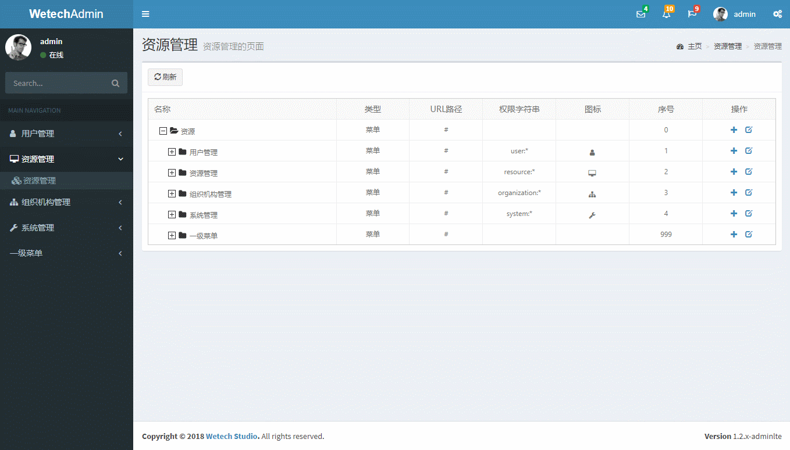

# Wetech-Admin

Wetech-Admin 是基于Maven+Spring+SpringMVC+Mybatis的轻量级后台管理系统，适用于中小型项目的管理后台，支持按钮级别的权限控制，系统具有最基本的用户管理、角色管理、资源管理、组织机构管理、系统日志、代码生成器等通用性功能，企业或个人可直接在此基础上进行开发，扩展，添加各自的需求和业务功能！http://wetech.tech/wetech-admin/

[获取 spring boot 版本](https://gitee.com/cjbi/wetech-admin/tree/1.6.x-rc1 "获取spring boot版本")

[获取 spring boot + mapper 4 + pageHelper 版本](https://gitee.com/cjbi/wetech-admin/tree/1.6.x-rc1 "获取spring boot版本")

[获取 AmazeUI 版本](https://gitee.com/cjbi/wetech-admin/tree/1.2.x "获取AmazeUI版本")

## 技术选型

### 后端技术

技术 | 名称 | 版本 | 官网
----|------|----|----
Spring Framework | 容器 | 4.3.5.RELEASE | [http://projects.spring.io/spring-framework/](http://projects.spring.io/spring-framework/)
SpringMVC | MVC框架 | 4.3.5.RELEASE |  [http://docs.spring.io/spring/docs/current/spring-framework-reference/htmlsingle/#mvc](http://docs.spring.io/spring/docs/current/spring-framework-reference/htmlsingle/#mvc)
MyBatis | ORM框架 | 3.2.1 |  [http://www.mybatis.org/mybatis-3/zh/index.html](http://www.mybatis.org/mybatis-3/zh/index.html)
Maven | 项目构建管理 | 4.0.0 |  [http://maven.apache.org](http://maven.apache.org/)
MyBatis Generator | 代码生成 | 1.3.5 |  [http://www.mybatis.org/generator/index.html](http://www.mybatis.org/generator/index.html)
Freemarker | 模板引擎 | 2.3.23 |  [https://freemarker.apache.org/](https://freemarker.apache.org/)
Apache Shiro | 安全框架 | 1.2.2 |  [http://shiro.apache.org](http://www.mybatis.org/generator/index.html)
Logback | 日志组件 | 1.1.3 |  [https://logback.qos.ch](https://logback.qos.ch/)
Druid | 数据库连接池 | 0.2.23 |  [https://github.com/alibaba/druid](https://github.com/alibaba/druid)
Hibernate Validator | 后端校验框架 | 5.4.2.Final | [http://hibernate.org/validator/](http://hibernate.org/validator/)

### 前端技术

技术 | 名称 | 版本 |  官网
----|------|----|----
jQuery | 优秀的Javascript库 | 3.2.1 |  [http://jquery.com/](http://jquery.com/)
AdminLTE 2 | 前端框架 | 2.4.2 |  [https://adminlte.io/themes/AdminLTE/](https://adminlte.io/themes/AdminLTE/)
bootstrap table | 数据表格 | 1.12.1 |  [https://www.datatables.net/](https://www.datatables.net/)
ZTree | jQuery树插件 | 3.5.29 |  [http://www.treejs.cn](http://www.treejs.cn)
chosen | 选择框插件 | 1.8.3 |  [https://github.com/harvesthq/chosen](https://github.com/harvesthq/chosen)

## 软件需求

- JDK1.8+
- MySQL5.6+
- Tomcat7.0+/jetty9.0+
- Maven3.0+

## 本地部署

- 通过git下载源码
- 创建数据库wetech_admin，数据库编码为UTF-8
- 执行docs/sql/init.sql文件，初始化数据
- 修改config.properties文件，更新MySQL账号和密码
- Eclipse、IDEA执行【clean package jetty:run】命令，即可运行项目
- 项目访问路径：http://localhost:8888/wetech-admin
- 账号密码：admin/123456

## 预览图

> 登陆界面

> 更换主题

> 菜单切换

> 表格浏览

> 增删改查

> 组织机构

> 资源管理

## 代码生成器

通过freemarker模板技术配合mybatis generator插件机制可以直接生成model、mapper、service、controller、service、jsp，单表增删改查不需要写任何代码，你也可以自定义模板，生成想要的代码。

注意：1.5.x版本暂时不提供前台生成代码，可以通过提供的Generator.java类生成。

[代码生成器文档](docs/wetech-admin/CodeGenerator.md)

## 在线访问

### 预览地址

[http://wetech.tech/wetech-admin](http://wetech.tech/wetech-admin "demo")

### 测试用户名密码
1. admin/123456
2. guest/123456

## 许可证

Wetech-Admin 使用 MIT 许可证发布，用户可以自由使用、复制、修改、合并、出版发行、散布、再授权及贩售Wetech-Admin 及其副本。

[查看许可证](LICENSE "LICENSE")

## 获取源码

 [https://github.com/cjbi/wetech-admin](https://github.com/cjbi/wetech-admin "github")

 [https://gitee.com/cjbi/wetech-admin](https://gitee.com/cjbi/wetech-admin "gitee")

