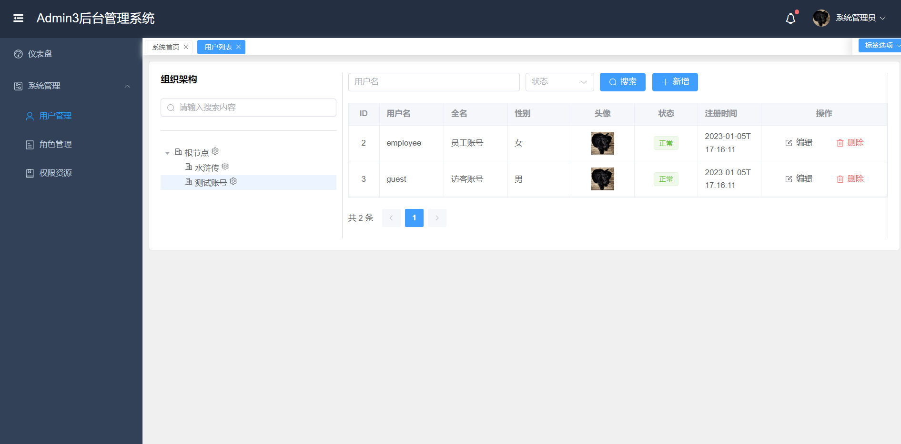

# Admin3

## 项目说明

项目使用最新的技术栈（后端Java17、SpringBoot3.0，前端TypeScript、Vite3、Vue3、Element plus），只提供了用户和权限管理的核心功能，简单高效不臃肿，适合作为基础工程二次定制开发、接私活、源码学习等场景

**体验地址：**  

http://metacode.wetech.tech:8082/admin3

备用地址（比较慢）：

https://gitpod.io/#https://github.com/cjbi/admin3

**测试账号：**

admin / 123456

拥有所有权限

employee / employee

拥有部分权限

guest  / guest

拥有查看权限

## 主要特性

* 未使用任何安全框架，实现了会话管理+权限控制功能，支持请求URL权限拦截，菜单、按钮级别权限控制
* 会话通过数据库作为二级缓存，即使重启也不会丢失登录状态
* 支持AOT编译Native镜像，相较于JVM节省至少50%的内存
* 前端资源支持独立部署+webjars嵌入到后端应用两种形式
* 使用SpringData JPA进行开发，能够支持多种数据库适配

## 项目预览





## 软件需求
- JDK 17
- MySQL 8.0
- Maven 3.6.0+

## 本地部署

- 通过git下载源码
- 创建数据库admin3，数据库编码为UTF-8
- 修改application.yml文件，更改MySQL账号和密码
- 启动服务，账号密码：`admin/123456`或者`guest/guest`
- 管理后台地址：http://localhost:8080/admin3
- Swagger地址：http://localhost:8080/admin3/swagger-ui/index.html

## 常用命令

### 服务端命令

- 编译打包
```
mvn clean package
```

- 安装到本地仓库
```
mvn clean install
```
说明：如果服务端使用webjars管理前端资源，强烈建议将admin3-ui安装到本地仓库

- 运行部署
```shell
cd admin3-server/target
nohup java -jar -Dspring.datasource.url=xxx -Dspring.datasource.username=xxx -Dspring.datasource.password=xxx admin3-server-0.0.1-SNAPSHOT.jar >/dev/null 2>&1 &
```

- 打包JVM镜像
```shell
mvn spring-boot:build-image -Dmaven.test.skip=true -Ddocker.image-name=xxx -Ddocker.username=xxx -Ddocker.password=xxx
```

- 打包native镜像
```shell
 mvn -Pnative spring-boot:build-image -Dmaven.test.skip=true -Ddocker.image-name=xxx -Ddocker.username=xxx -Ddocker.password=xxx
```

### 前端命令

- 安装依赖
```
yarn install
```

- 开发模式运行
```
yarn dev
```

- 编译项目
```
yarn build
```

## 许可证

MIT
