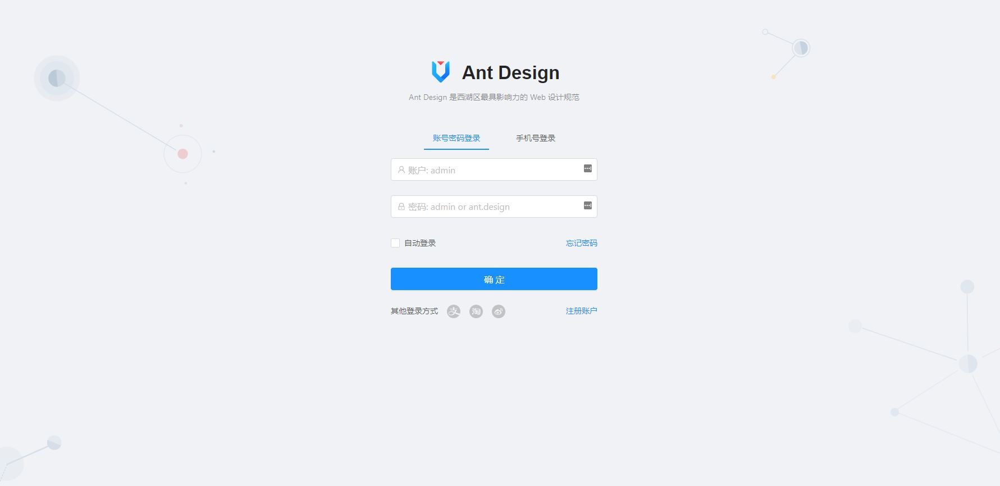
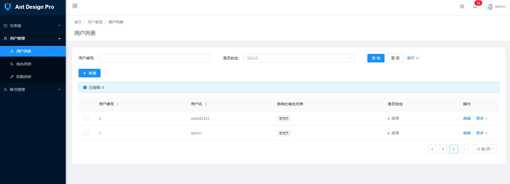
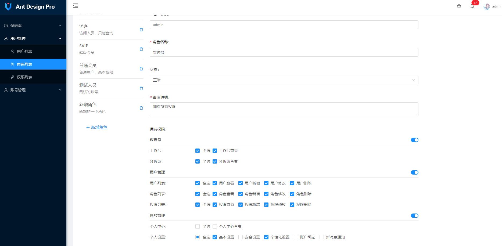
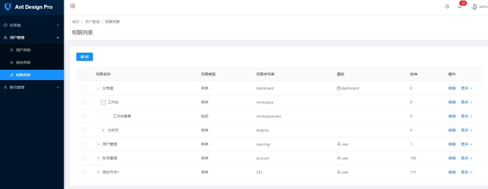

# Wetech-Admin

Wetech-Admin 是基于 Spring Boot 2.0 + Mybatis + Vue 的轻量级后台管理系统，适用于中小型项目的管理后台，支持按钮级别的权限控制，系统具有最基本的用户管理、角色管理、权限管理等通用性功能，企业或个人可直接在此基础上进行开发，扩展，添加各自的需求和业务功能！http://wetech.tech/wetech-admin/


## 技术选型

### 后端技术

技术 | 名称 | 版本 | 官网
----|------|----|----
Spring Boot | 应用框架 | 2.3.2.RELEASE | [https://projects.spring.io/spring-boot/](https://projects.spring.io/spring-boot/)
MyBatis | 持久层框架 | 3.2.1 |  [http://www.mybatis.org/mybatis-3/zh/index.html](http://www.mybatis.org/mybatis-3/zh/index.html)
MyBatis-Ext | 基于MyBatis的增强扩展| 1.6.5 |  [https://github.com/cjbi/mybatis-ext](https://github.com/cjbi/mybatis-ext)
Maven | 项目构建管理 | 4.0.0 |  [http://maven.apache.org](http://maven.apache.org/)
Apache Shiro | 安全框架 | 1.6.0 |  [http://shiro.apache.org](http://shiro.apache.org)
Logback | 日志组件 | 1.1.3 |  [https://logback.qos.ch](https://logback.qos.ch/)
Hibernate Validator | 后端校验框架 | 5.4.2.Final | [http://hibernate.org/validator/](http://hibernate.org/validator/)
swagger | 在线文档生成 |  3.0.0 | [https://swagger.io/](https://swagger.io/) 

### 前端技术

技术 | 名称 | 版本 |  官网
----|------|----|----
Vue | 渐进式JavaScript框架 | 2.6.10 |  [https://cn.vuejs.org/](https://cn.vuejs.org/)
Ant Design Pro Vue | 基于 Ant Design Vue 的 Pro 第三方实现 | 1.4.2 |  [https://pro.antdv.com/)

## 软件需求

- JDK1.8+
- MySQL5.6+
- Maven3.0+

## 本地部署

- 通过git下载源码
- 创建数据库wetech_admin，数据库编码为UTF-8
- 依次执行src/main/resources/schema.sql和dsrc/main/resources/data.sql文件，初始化数据
- 修改application-dev.properties文件，更新MySQL账号和密码
- 启动服务，账号密码：`admin/123456`或者`guest/123456`
- 管理后台地址：http://localhost:8080
- Swagger地址：http://localhost:8080/swagger-ui/

### 服务端命令
- 打包编译
```
mvn clean package
```
- 运行部署
```
nohup java -jar -Dspring.profiles.active=development wetech-admin-server-2.0.0.jar >/dev/null 2>&1 &
```
### 前端功能命令

- 安装依赖
```
yarn install
```

- 开发模式运行
```
yarn run serve
```

- 编译项目
```
yarn run build
```

- Lints and fixes files
```
yarn run lint
```

## 预览图





## 在线访问

### 预览地址

[http://wetech.tech/wetech-admin](http://wetech.tech/wetech-admin "wetech-admin")

### 测试用户名密码
1. admin/123456
2. guest/123456

## 许可证

Wetech-Admin 使用 MIT 许可证发布，用户可以自由使用、复制、修改、合并、出版发行、散布、再授权及贩售Wetech-Admin 及其副本。

[查看许可证](LICENSE "LICENSE")

## 获取源码

 [https://github.com/cjbi/wetech-admin](https://github.com/cjbi/wetech-admin "github")

 [https://gitee.com/cjbi/wetech-admin](https://gitee.com/cjbi/wetech-admin "gitee")

