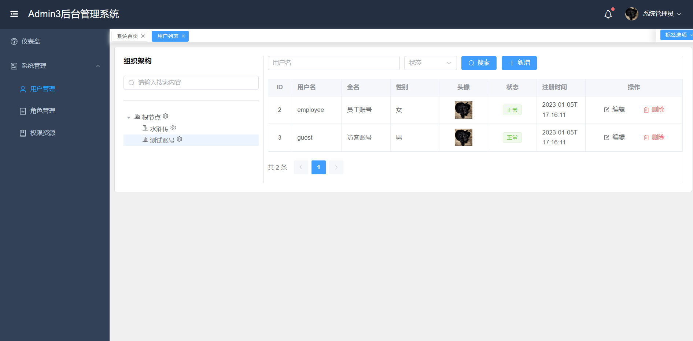
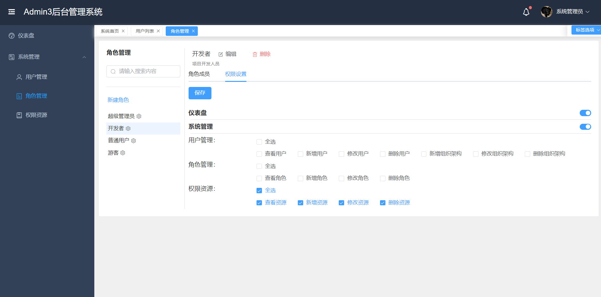
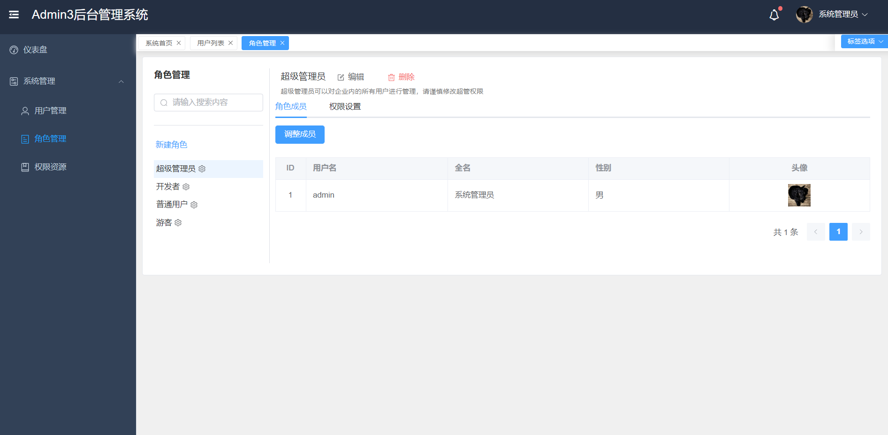
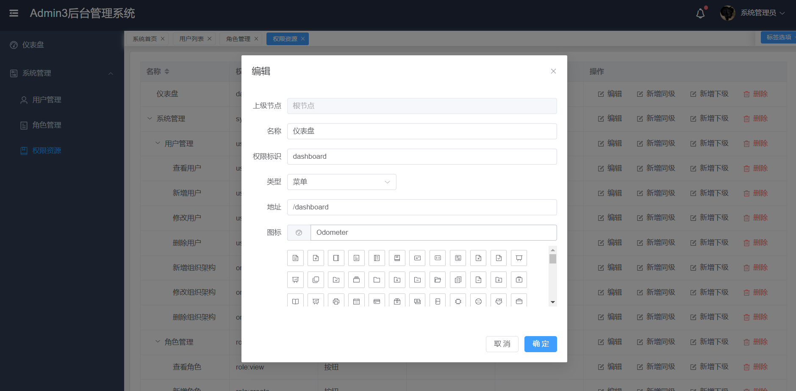
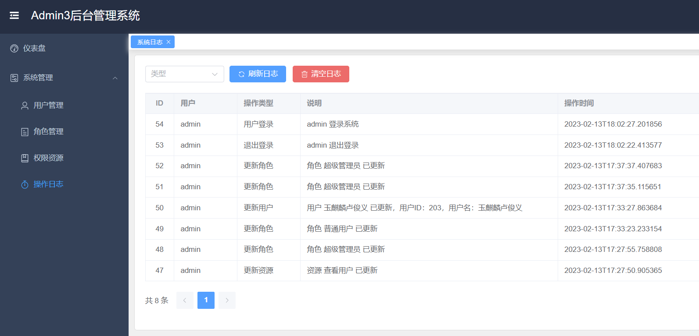
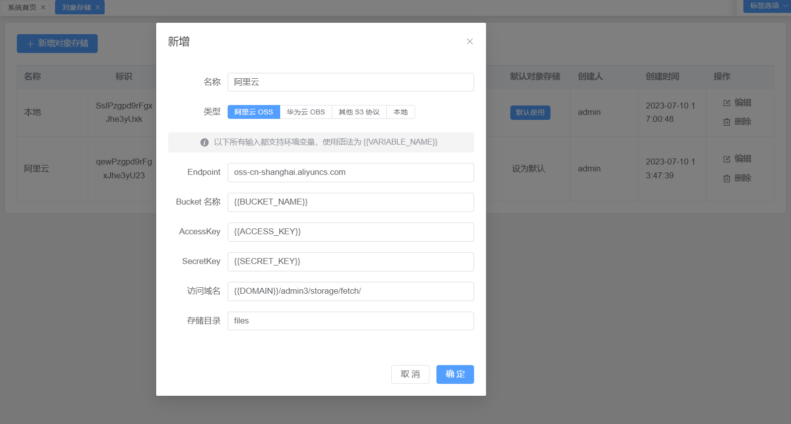

# Admin3

## 项目说明

项目使用最新的技术栈（后端Java21、SpringBoot3.2，前端TypeScript、Vite3、Vue3、Element Plus），只提供了用户和权限管理的核心功能最佳实践方案，适合作为基础工程二次定制开发、接私活、源码学习等场景

## 主要特性

* 未使用任何安全框架，优雅地实现了会话管理+权限控制功能，支持请求URL权限拦截，菜单、按钮级别权限控制
* 会话通过数据库作为二级缓存，即使重启也不会丢失登录状态
* 支持AOT编译Native镜像，相较于传统JVM形式节省了至少50%的内存
* 前端资源支持独立部署+webjars嵌入到后端应用两种形式
* 持久层使用SpringData JPA进行开发，能够支持多种数据库适配
* 所有的接口都有端到端的测试用例覆盖，有代码变动都会全量跑一遍测试用例，保证功能绝对可用
* 统一对象存储封装，实现应用和上传文件位置隔离，支持本地上传&所有符合S3标准（阿里云、华为云、MinIO等）的对象存储方案

## 在线体验

- admin / 123456 (拥有所有权限)
- employee / employee (拥有部分权限)
- guest / guest (拥有查看权限)

演示地址： https://admin3.wetech.tech

在线部署： https://gitpod.io/#https://github.com/cjbi/admin3

## 项目预览

<table>
    <tr>
        <td></td>
        <td></td>
    </tr>
    <tr>
        <td></td>
        <td></td>
    </tr>
    <tr>
       <td></td>
       <td></td>
    </tr>
    <tr>
       <td></td>
    </tr>
</table>

## 技术文档

- [权限管理](docs/authority-management.md)

- [目录结构](docs/struct.md)

- [API 参考](docs/api-reference.md)

- [对象存储](docs/storage.md)

- [常用命令](docs/command.md)

## 软件需求

- JDK 17
- MySQL 8.0
- Maven 3.6.0+

## 本地部署

- 通过git下载源码
- 创建数据库admin3，数据库编码为UTF-8
- 修改application.yml文件，更改MySQL账号和密码
- 启动服务，访问管理后台地址：http://localhost:8080/admin3
- Swagger地址：http://localhost:8080/admin3/swagger-ui/index.html

## 待办列表

- [x] 操作日志

- [x] 文件上传（常用第三方对象存储服务统一封装），支持修改用户头像

- [ ] 国际化

- [ ] 更多功能请 [Issues](https://github.com/cjbi/admin3/issues) 留言

欢迎参与项目贡献！

## 许可证

[MIT](LICENSE)
