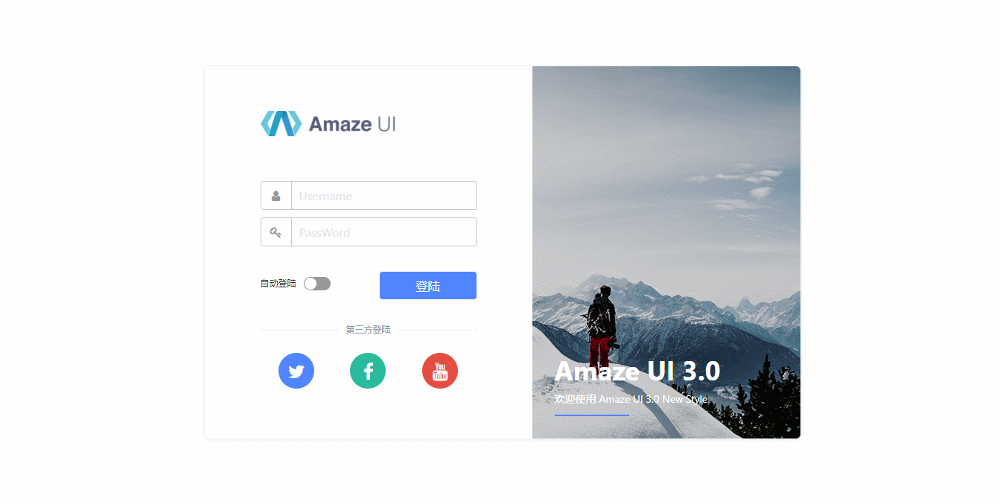
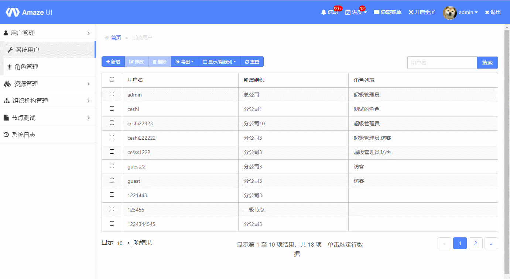
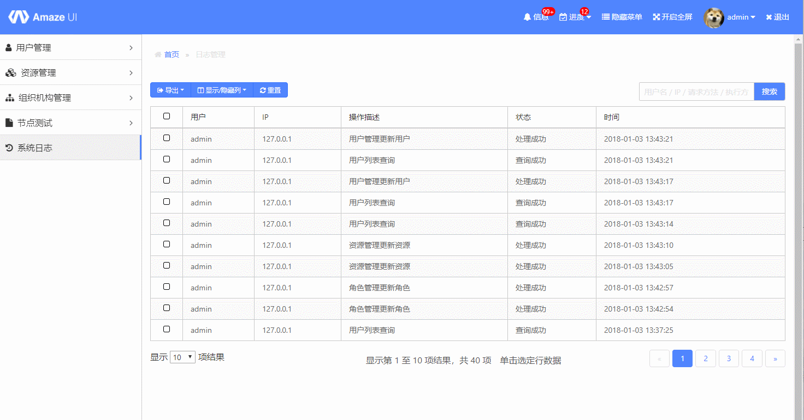
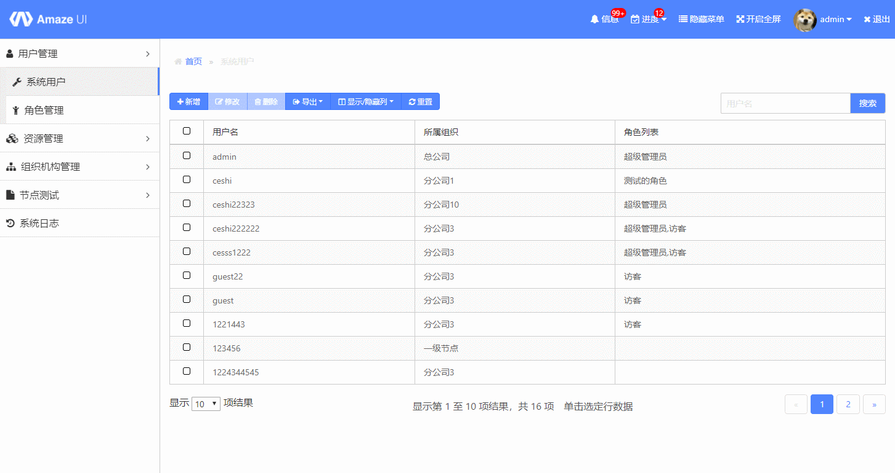
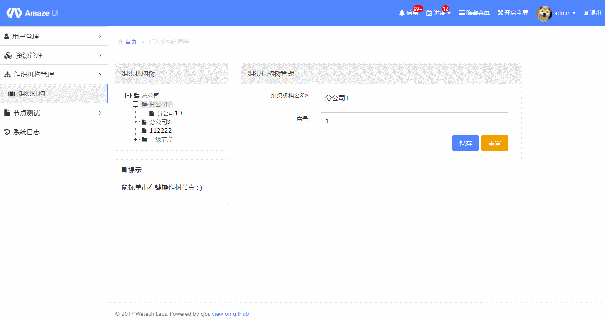
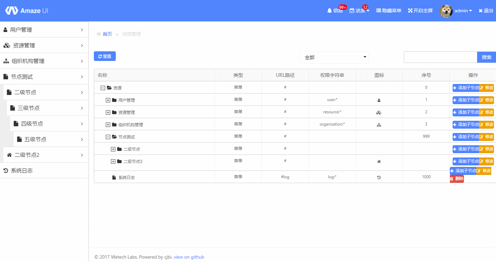
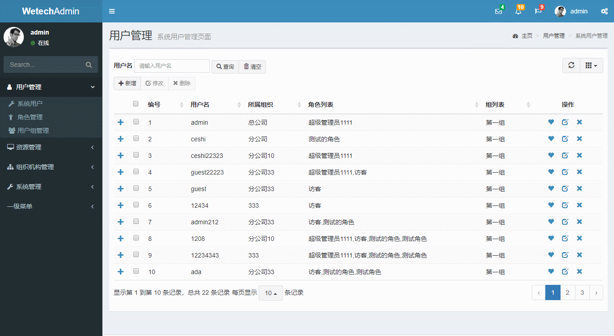

# Wetech-Admin

Wetech-Admin 是基于 Spring Boot 2.0 + Mybatis 的轻量级后台管理系统，适用于中小型项目的管理后台，支持按钮级别的权限控制，系统具有最基本的用户管理、角色管理、资源管理、组织机构管理、系统日志、代码生成器等通用性功能，企业或个人可直接在此基础上进行开发，扩展，添加各自的需求和业务功能！http://wetech.tech/wetech-admin/

## 技术选型

### 后端技术

技术 | 名称 | 版本 | 官网
----|------|----|----
Spring Boot | 应用框架 | 2.0.0.RELEASE | [https://projects.spring.io/spring-boot/](https://projects.spring.io/spring-boot/)
MyBatis | ORM框架 | 3.2.1 |  [http://www.mybatis.org/mybatis-3/zh/index.html](http://www.mybatis.org/mybatis-3/zh/index.html)
Mapper | MyBatis 通用 Mapper4 | 4.0.0 |  [https://gitee.com/free/Mapper](https://gitee.com/free/Mapper)
PageHelper | MyBatis 分页插件 | 5.1.2 |  [https://gitee.com/free/Mybatis_PageHelper](https://gitee.com/free/Mybatis_PageHelper)
Maven | 项目构建管理 | 4.0.0 |  [http://maven.apache.org](http://maven.apache.org/)
MyBatis Generator | 代码生成 | 1.3.5 |  [http://www.mybatis.org/generator/index.html](http://www.mybatis.org/generator/index.html)
Thymeleaf | 模板引擎 | 3.0.9.RELEASE |  [https://www.thymeleaf.org/](https://www.thymeleaf.org/)
Apache Shiro | 安全框架 | 1.2.2 |  [http://shiro.apache.org](http://www.mybatis.org/generator/index.html)
Logback | 日志组件 | 1.1.3 |  [https://logback.qos.ch](https://logback.qos.ch/)
Druid | 数据库连接池 | 0.2.23 |  [https://github.com/alibaba/druid](https://github.com/alibaba/druid)
Hibernate Validator | 后端校验框架 | 5.4.2.Final | [http://hibernate.org/validator/](http://hibernate.org/validator/)

### 前端技术

技术 | 名称 | 版本 |  官网
----|------|----|----
jQuery | 优秀的Javascript库 | 3.2.1 |  [http://jquery.com/](http://jquery.com/)
Admin-LTE| 基于Bootstrap的前端框架 | 3.0.0 |  [https://adminlte.io/](https://adminlte.io/)
Bootstrap Table | 数据表格 | 1.10.16 |  [http://bootstrap-table.wenzhixin.net.cn/zh-cn/getting-started/](http://bootstrap-table.wenzhixin.net.cn/zh-cn/getting-started/)
Layer | jQuery弹出层插件 | 3.1.0 |  [http://layer.layui.com/](http://layer.layui.com/)
ZTree | jQuery树插件 | 3.5.29 |  [http://www.treejs.cn](http://www.treejs.cn)

## 软件需求

- JDK1.8+
- MySQL5.6+
- Maven3.0+

## 本地部署

- 通过git下载源码
- 创建数据库wetech_admin，数据库编码为UTF-8
- 依次执行docs/sql/schema.sql和docs/sql/data.sql文件，初始化数据
- 修改application-dev.properties文件，更新MySQL账号和密码
- 运行Maven命令mvn install
- 运行WetechAdminApplication类
- 项目访问路径：http://localhost:8888/wetech-admin
- 账号密码：admin/123456

## 预览图

> 登陆界面

> 菜单树切换

> 表格浏览

> 增删改查

> 组织机构

> 资源管理

> 自适应测试

## 代码生成器

已集成通用 Mapper 专用代码生成器Maven插件，使用该插件可以很方便的生成实体类、Mapper接口以及对应的XML文件。

首先对MBG不太了解的可以先阅读下面的文档

[Mybatis Geneator 详解](https://blog.csdn.net/isea533/article/details/42102297)

通用 Mapper 专用代码生成器生成的 Model 会在原有基础上增加 @Table,@Id,@Column 等注解，方便自动会数据库字段进行映射。

运行代码生成器需要使用命令

`mvn mybatis-generator:generate`

## 在线访问

### 预览地址

[http://wetech.tech/wetech-admin](http://wetech.tech/wetech-admin "demo")

### 测试用户名密码
1. admin/123456
2. guest/123456

## 许可证

Wetech-Admin 使用 MIT 许可证发布，用户可以自由使用、复制、修改、合并、出版发行、散布、再授权及贩售Wetech-Admin 及其副本。

[查看许可证](LICENSE "LICENSE")

## 获取源码

 [https://github.com/cjbi/wetech-admin](https://github.com/cjbi/wetech-admin "github")

 [https://gitee.com/cjbi/wetech-admin](https://gitee.com/cjbi/wetech-admin "gitee")

