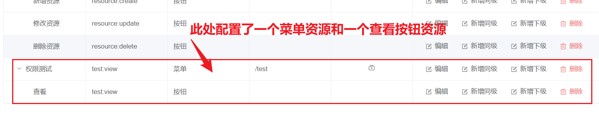
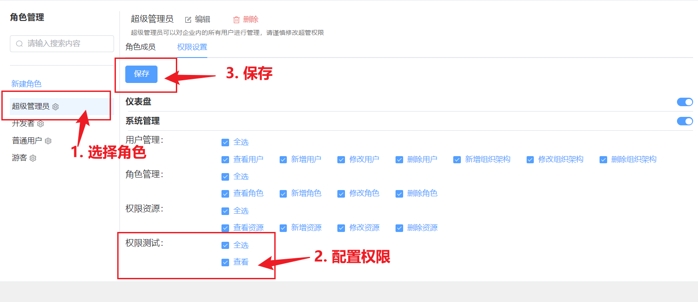
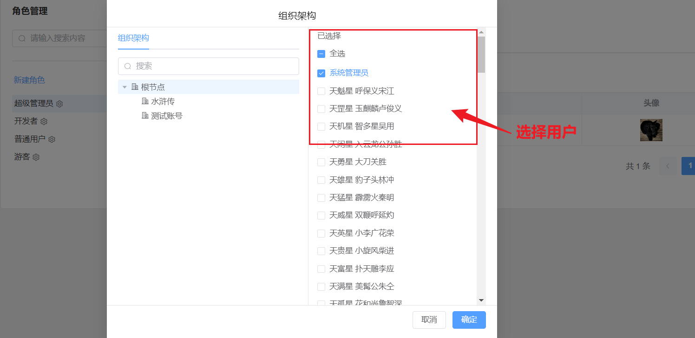
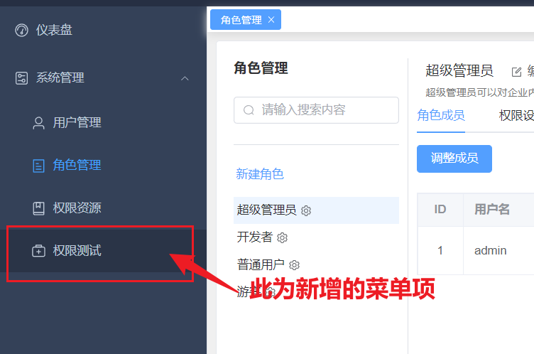

# 权限管理

Admin3基于RBAC模型进行权限控制，RBAC 是基于角色的访问控制（Role-Based Access Control ）在 RBAC 中，权限与角色相关联，用户通过成为适当角色的成员而得到这些角色的权限。这就极大地简化了权限的管理。这样管理都是层级相互依赖的，权限赋予给角色，而把角色又赋予用户，这样的权限设计很清楚，管理起来很方便。

## 配置

1. 在`系统管理>权限资源` 页面新增资源
  
   > 资源分为菜单资源和按钮资源，其中菜单资源需要指定菜单图标和菜单地址，菜单地址需要在vue-router中进行路由注册，按钮资源需要前端对按钮的指令权限进行判断展示隐藏。

    

2. 在`系统管理>角色管理>权限设置`中选中要配置的角色, 在`权限设置`标签中选择对应的权限，在`角色成员`标签中调整角色成员

   
   

3. 刷新页面，就能看到多出的菜单项

  

## 权限字符串

权限标识支持Apache Shiro同款的权限字符串规则，字符串通配符权限规则：
```
资源标识符:操作:对象实例ID
```

即对哪个资源的哪个实例可以进行什么操作。 其默认支持通配符权限字符串，
“:”表示资源/操作/实例的分割；“,”表示操作的分割； “*”表示任意资源/操作/实例。

对权限字符串缺失部分的处理：

如“user:view”等价于“user:view:”；而“organization”等价于“organization:”或者
“organization::”。可以这么理解，这种方式实现了前缀匹配。
另外如“user:”可以匹配如“user:delete”、“user:delete”可以匹配如“user:delete:1”、
“user::1”可以匹配如“user:view:1”、“user”可以匹配“user:view”或“user:view:1”
等 。即 可 以 匹配所 有， 不加 可 以 进行前 缀匹 配；但 是如“ :view” 不能匹 配
“system:user:view”，需要使用“::view”，即后缀匹配必须指定前缀（多个冒号就需要
多个来匹配）。

## URL权限拦截过滤

可通过后端 @RequiresPermissions 注解进行接口权限过滤，示例如下
```
@RequiresPermissions("user:update")
@PutMapping("/{userId}")
public ResponseEntity<User> updateUser(@PathVariable Long userId, @RequestBody @Valid UpdateUserRequest request) {
  Organization organization = organizationService.findOrganization(request.organizationId());
  return ResponseEntity.ok(userService.updateUser(userId, request.avatar(), request.gender(), User.State.NORMAL, organization));
}
```

@RequiresPermissions参数说明

```java
@Target({ElementType.TYPE, ElementType.METHOD})
@Retention(RetentionPolicy.RUNTIME)
public @interface RequiresPermissions {

  /**
  * 可指定一到多个权限字符串
  * 
  */
  String[] value();

  /**
  * 多个权限字符串的关系，支持AND（全部匹配）\OR（任一匹配），默认是AND的关系
  *
  */
  Logical logical() default Logical.AND;
}
```

## 前端指令权限

Admin3封装了一个非常方便实现按钮级别权限的自定义指令。 v-action

使用

```html
<template>
    <!-- 校验是否有 user:create 操作权限-->
    <el-button v-action:user:create>创建用户</el-button>
  
    <!-- 校验是否有 user:delete 操作权限 -->
    <el-button v-action:user:delete>删除用户</el-button>
  
    <!-- 校验是否有 user:update 操作权限 -->
    <el-button v-action:user:update>更新用户</el-button>
</template>
```

实现思路：

在Vue初始化时，将action命令注册道Vue原型链上(src/main.ts)，在Vue实例中，从store中获取用户的 permissions进行权限判断
