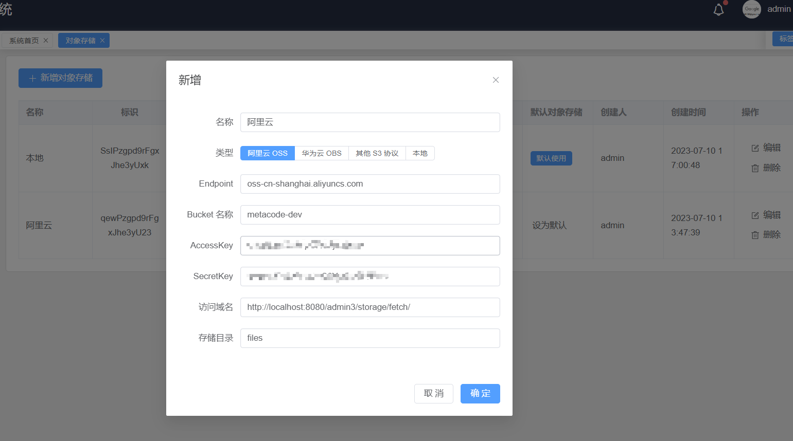
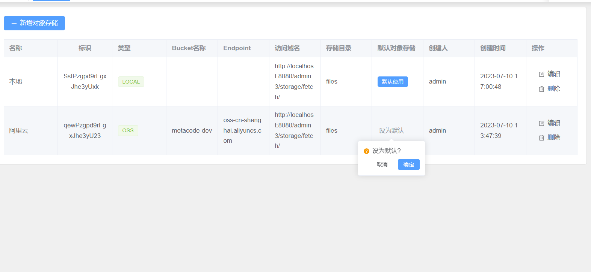

# 对象存储

Admin3 已实现阿里云OSS、华为云OBS、MinIO 等符合 S3 标准的所有对象存储方案的统一封装，支持同时使用多个对象存储。

## 配置

1. 在`系统管理>对象存储` 页面新增对象存储

   > 访问域名不填写，则返回对象存储厂商地址，不使用代理，代理路径为 `${domain}/admin3/storage/fetch/`，${domain} 根据实际外网地址配置
   > 存储目录不配置默认为 `files`

   

2. 设置为默认存储位置

   

## 文件上传接口

POST /storage/upload

Content-Type: multipart/form-data

表单参数

| 名称        | 说明                 |
|-----------|--------------------|
| files     | 二进制，支持多个文件         |
| storageId | 上传存储位置，非必填，不填则默认位置 |

返回

```json lines
[
  {
    "url": "http://xxx"
  },
  {
    "url": "http://xxx"
  }
]
```

## 获取文件

POST /storage/fetch/{key:.+}

Content-Type: application/octet-stream

返回二进制流

## 下载文件

POST /storage/download/{key:.+}


Content-Type: application/octet-stream

Content-Disposition: "attachment; filename=\"" + file.getFilename() + "\""

返回二进制流
